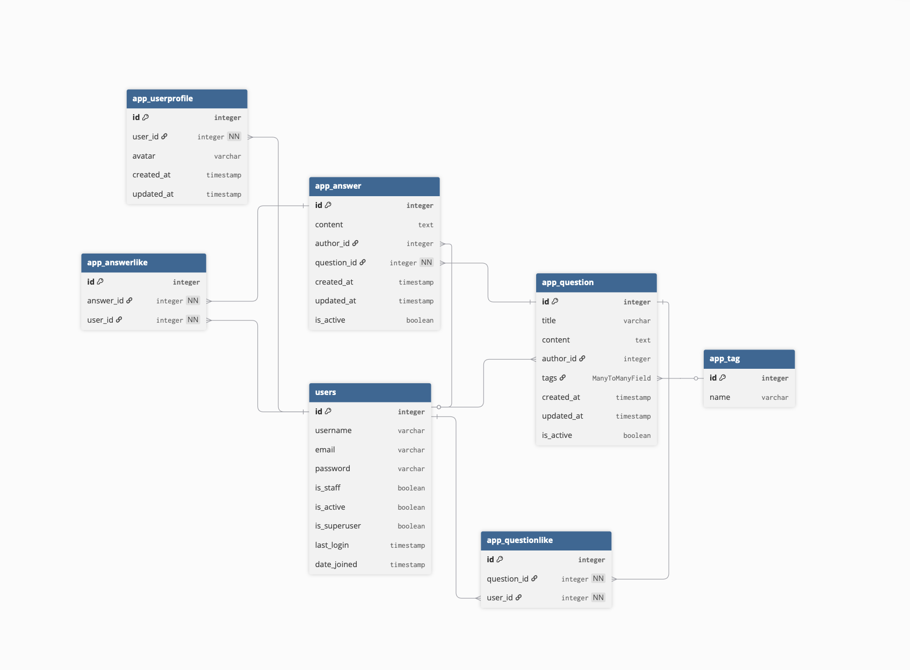

# Ask Pupkin

## Запуск приложения

```bash
git clone <repo>
cd ask_pupkin
docker-compose up -d --build
docker-compose exec web python manage.py migrate
docker-compose exec web python manage.py fill_db 100
```

## Завершение приложения

```bash
 docker-compose down
```

## Пример конфигурационного файла

```dotenv
# Common settings
DEBUG=True
ALLOWED_HOSTS=localhost,127.0.0.1

# Secret key
SECRET_KEY=django-insecure-hlbl#sqak)376kioou%z&49n#vr9gqt&iwenb)!=^-t%fg&(qk

# Database settings
DB_ENGINE=django.db.backends.postgresql
DB_NAME=ask_pupkin
DB_USER=postgres
DB_PASSWORD=spring20
DB_HOST=localhost
DB_PORT=5432

```

Приложение доступно: http://localhost:8000

