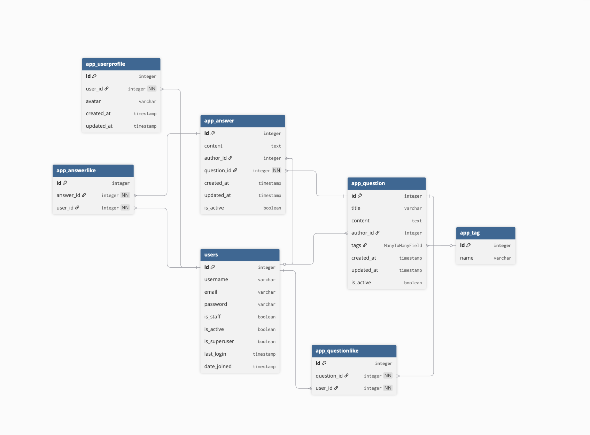

# Ask Pupkin

## Запуск приложения

```bash
git clone <repo>
cd askme_chukhvichev
docker-compose up -d --build
docker-compose exec web python manage.py migrate
docker-compose exec web python manage.py fill_db 100
```

## Завершение приложения

```bash
 docker-compose down
```

## Пример конфигурационного файла

```dotenv
# Common settings
DEBUG=True
ALLOWED_HOSTS=localhost,127.0.0.1

# Secret key
SECRET_KEY=django-insecure-hlbl#sqak)376kioou%z&49n#vr9gqt&iwenb)!=^-t%fg&(qk

# Database settings
DB_ENGINE=django.db.backends.postgresql
DB_NAME=ask_pupkin
DB_USER=postgres
DB_PASSWORD=spring20
DB_HOST=localhost
DB_PORT=5432

```

Приложение доступно: http://localhost:8000



## Ответы на вопросы по 5 домашней работе

1. Статика через nginx:
Requests per second:    8787.62 [#/sec] (mean)

2. Статика через gunicorn:
Requests per second:    709.29 [#/sec] (mean)

3. Динамика через gunicorn (прямой доступ):
Requests per second:    1140.14 [#/sec] (mean)

4. Динамика через nginx (без кэша):
Requests per second:    993.01 [#/sec] (mean)

5. Динамика через nginx (с кэшем):
   Тестируем кэшированный ответ:
Requests per second:    8864.07 [#/sec] (mean)

Статика через Nginx отдаётся в 7.7 раза быстрее динамики через Gunicorn.
Кэширование на стороне Nginx ускоряет обработку динамического контента в 8.9 раза